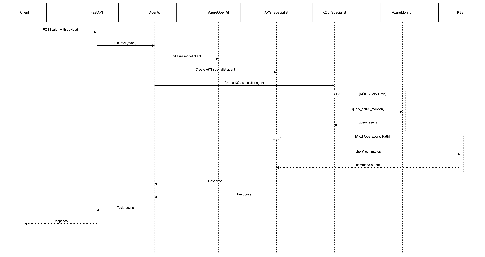

# MAS Multi-Agents MVP
Multi-agent architecture using Magentic-One agent from Autogen

## Pre-requisites for development
VSCode
python 3.13.2


## How to run it local

- Define the following environment variables either in a .env file or directly in the docker run:

      ```
      AZURE_OPENAI_DEPLOYMENT=
      AZURE_OPENAI_MODEL=
      AZURE_OPENAI_API_VERSION=
      AZURE_OPENAI_ENDPOINT=
      AZURE_OPENAI_API_KEY=
      PORT=8080
      ``` 

- Build and run the image
   ```
   docker build -t mas-app .
   docker run --env-file .env -p 8080:8080 mas-app
   ```

- Send a payload to test it:

   ```
   curl -X POST http://localhost:8080 \           
   -H "Content-Type: application/json" \
   -d '{"task":"Write a Python script to fetch data from an API."}'
   ```

## Architecture overview


## Sequence diagram

